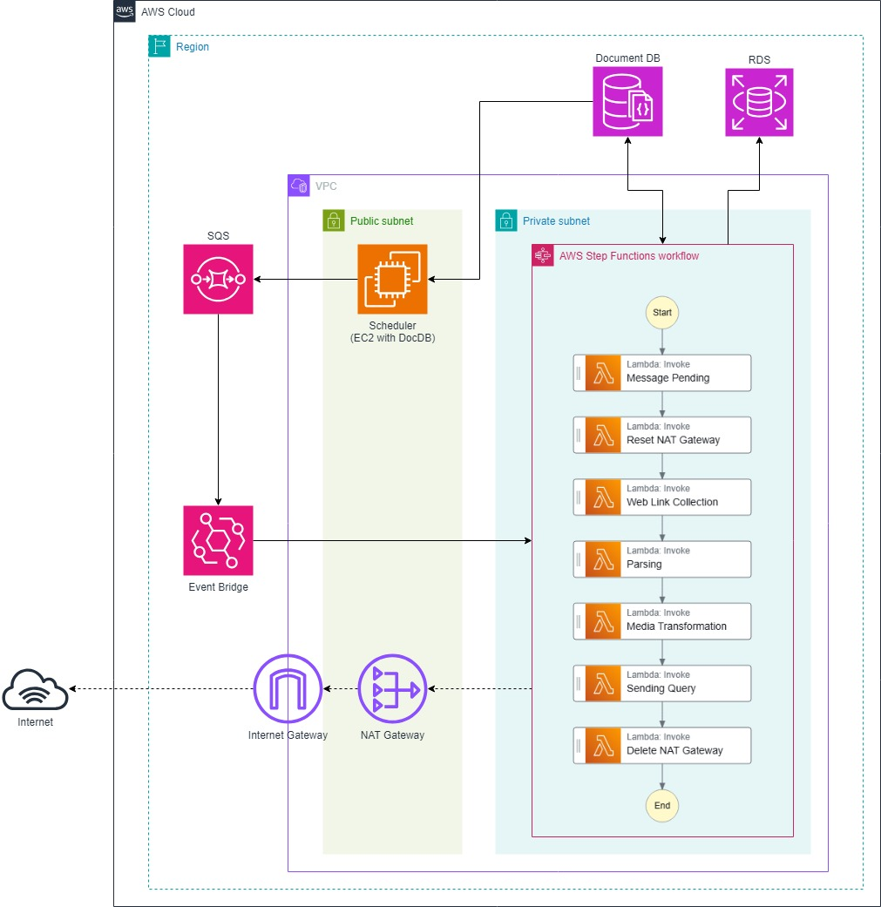

# 📊 GachiSpider

<center></center>

> **GachiSpider** is a web crawling system dependent on AWS, leveraging services such as DocDB, RDS, Step Functions, and SQS, and implemented in Python. It incorporates a feature to verify compliance with the 'robots.txt' protocol and is designed to minimize the load imposed on webmasters from repeated web access. The system retrieves data starting from the root node and subsequently refines it, making it **unsuitable** for individuals seeking a high-speed, large-scale web crawling solution.

## 📝 Table of Contents

- [📊 GachiSpider](#-gachispider)
  - [📝 Table of Contents](#-table-of-contents)
  - [Introduction](#introduction)
  - [Configuration(Setup)](#configurationsetup)
    - [AWS Lambda Deployment](#aws-lambda-deployment)
    - [CodePipeline Setup](#codepipeline-setup)
    - [Step Functions Setup and SQS Integration Using EventBridge](#step-functions-setup-and-sqs-integration-using-eventbridge)
    - [Migrating the Scheduler to EC2](#migrating-the-scheduler-to-ec2)
  - [Architecture](#architecture)
  - [Contributions](#contributions)
  - [License](#license)

## Introduction

What does the gentlest form of web crawling entail? A crawler that provides promotional benefits to webmasters and ultimately offers economic advantages would be considered a happy crawler. I believe that the gentlest approach involves not causing harm to webmasters, by collecting only what they permit and doing so gradually. This project is designed with the goal of crawling as gently as possible. Ultimately, intelligent technology will be employed to adjust crawling intervals and collect data while considering the traffic of specific websites.

<center></center>

As mentioned earlier, if a large-scale crawling system is required, this project is not recommended. The system architecture for large-scale crawling is suggested above, and if needed, we can discuss insights on data lake methodologies.

## Configuration(Setup)

### AWS Lambda Deployment
To create AWS Lambda functions, align with the ./aws/lambda directory structure. You may utilize either the CLI or the AWS Console for deployment. Following the AWS architecture outlined in the README, the Lambdas should be assigned to a VPC. In case of web access issues, replacing public IPs incurs significant overhead. To mitigate this, configure the routing table to place the Lambdas within a private subnet, enabling seamless progress by simply replacing the NAT Gateway.

### CodePipeline Setup
Establish an **AWS CodePipeline**. Since you are not the owner of this project, connect the forked Git repository link to Code Connections. Next, set up **CodeBuild**, referencing the buildspec.yml file available at the root of the code repository. Finally, proceed with the deployment step. While you can deploy using either the CLI or SAM (Serverless Application Model), the latter allows for Pre/Post Traffic testing during deployment. Given that these Lambda functions are integrated with **Step Functions**, testing can also be conducted within the Step Functions workflow.

### Step Functions Setup and SQS Integration Using EventBridge
A scheduler, operated on EC2, will request arbitrary URLs through SQS based on freshness criteria. The SQS queue (default batch size of 1) will then trigger a Step Functions workflow that executes a sequence of processes: web fetching, data ingestion, transformation, and storage. According to the repository's Lambda setup, the workflow progresses as follows: **Initializer → Manager → Parser → Transformer → Query**. The **replace**ment of the **NAT Gateway** can be placed **upstream of the Manager**, while the **del**etion of the **NAT Gateway** can be appended **downstream of the Transformer**.

### Migrating the Scheduler to EC2
Migrate the Scheduler to an EC2 instance connected to DocumentDB. While there are several classes within the spider/scheduler directory, the **fully tested scheduler is located in container.py**.

## Architecture

```
./
├── aws/ # Set up the CI/CD environment within this directory.
├── spider/ 
    ├── scheduler/
    ├── manager/
    ├── crawler/
    ├── transformer/
    ├── query/
    └── ...
└── ...
```
**Scheduler**: Manages freshness for root nodes stored in DocumentDB and handles events such as state management within Step Functions.

**Manager**: Extracts crawled URLs from a single root node input and evaluates whether they comply with robots.txt.

**Crawler**: Responsible for actively accessing the web and acquiring the necessary data.

**Transformer**: Downloads required media from the crawled data and converts it into the desired format.

**Query**: Responsible for delivering the processed data or information to the appropriate RDS, depending on the domain.

<center></center>

## Contributions
Contributions are welcome! If you have any improvements, please submit a pull request. Refer to ./.github/template/ for guidance. If there are additional details or any inaccuracies, feel free to use the Issues feature. Thank you.

## License
This repository is licensed under the Apache 2.0. You are free to use, modify, and distribute the code, with the exception of the 'Matcher' class functionalities, which are explicitly restricted.

Restriction on 'Matcher' class:

Bypassing or using the 'Matcher' class functionalities outside the scope of this repository is prohibited. Any unauthorized use may result in legal action.